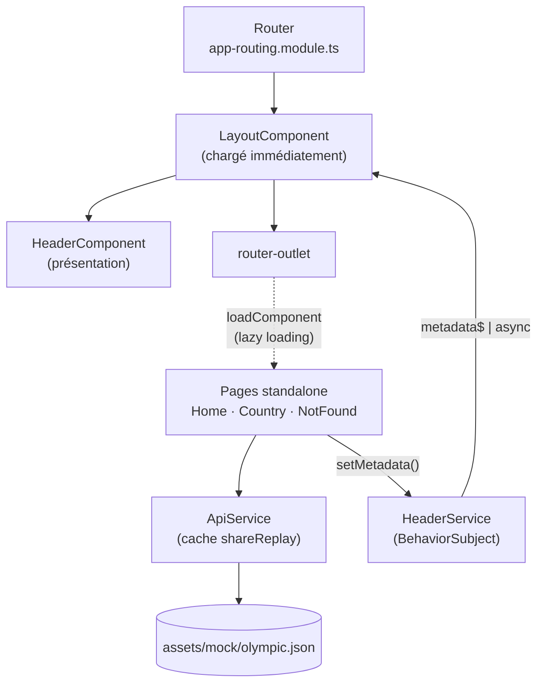

# Architecture

Ce document résume l'architecture de l'application et les solutions apportées aux problèmes relevés dans [`notes-architecture.md`](./notes-architecture.md).

## Vue d'ensemble



- Le **layout** est la coquille de l'application : header, zone de contenu et loader de navigation.
- Les **pages** sont chargées à la demande et récupèrent leurs données via `ApiService`.
- Chaque page transmet le titre et les indicateurs à afficher dans le header via `HeaderService`.

## Structure

```
src/
├── index.html
├── styles.scss                     # styles globaux et grille responsive (.grid)
├── styles/
│   └── _breakpoints.scss           # points de rupture et mixins (tablet, desktop)
└── app/
    ├── app.module.ts               # module racine
    ├── app-routing.module.ts       # route du layout et préchargement des pages
    ├── layout/
    │   ├── layout.component.*      # header + <router-outlet> + loader de navigation
    │   └── layout.routes.ts        # routes des pages, chargées en lazy loading
    ├── pages/                      # composants affichés par le router (standalone)
    │   ├── home/
    │   ├── country/
    │   └── not-found/
    ├── models/
    │   └── olympic.model.ts        # interfaces Olympic, Participation, Metadata…
    └── shared/
        ├── component/
        │   ├── layout/header/      # header (titre et indicateurs), composant de présentation
        │   └── loader/             # spinner réutilisable
        └── service/
            ├── api.service.ts      # accès aux données, avec cache
            └── header.service.ts   # titre et indicateurs affichés dans le header
```

## Problèmes relevés et solutions

Les numéros renvoient aux sections de `notes-architecture.md`.

| # | Problème | Solution |
|---|---|---|
| 1 | Manque de structure modulable | Séparation en `layout/`, `pages/`, `models/` et `shared/` (composants et services réutilisables) |
| 1 | Header répété dans les composants | Un seul `HeaderComponent`, affiché par le layout et alimenté par `HeaderService` |
| 1 | Appels HTTP directement dans les composants | Accès aux données centralisé dans `ApiService` |
| 1 | Mêmes requêtes HTTP dans plusieurs composants | Cache avec `shareReplay(1)` : une seule requête pour toute l'application |
| 2 | Manque de modèles et de typage | Interfaces dans `models/olympic.model.ts` |
| 2 | Mauvaise gestion des observables | Pipe `async` dans le layout, cache partagé, destruction des graphiques avec `DestroyRef` |
| 2 | Données manquantes sur la page pays | Graphique en courbe des médailles par édition, avec trois indicateurs |
| 3 | Application non responsive | Grille CSS 4 / 8 / 12 colonnes, en *mobile first* |
| 3 | Manque de loading | `LoaderComponent`, loader de navigation et loader des données |
| 3 | Taille du pie chart | Taille fixée par le conteneur (`aspect-ratio`) |
| 4 | Manque de cache | `shareReplay(1)` dans `ApiService` |
| 4 | Risque de fuite mémoire des graphiques | `chart.destroy()` à la destruction de la page |
| 4 | Pas de lazy loading | Pages standalone chargées avec `loadComponent`, et préchargement |

## Choix techniques

### Données et cache
`ApiService` charge le JSON **une seule fois** grâce à `shareReplay(1)`. Les pages suivantes réutilisent la valeur en cache, sans nouvelle requête HTTP. `getCountryById()` se base sur ce même flux.

### Header partagé
Le header est affiché par le layout, mais son contenu dépend de la page. Chaque page transmet son titre et ses indicateurs à `HeaderService`, un `BehaviorSubject`. Le layout les affiche avec le pipe `async`, qui gère lui-même l'abonnement et le désabonnement.

### Lazy loading
- Les pages sont des **composants standalone**, chargés avec `loadComponent` dans `layout.routes.ts`.
- Chaque page a son propre fichier JavaScript (*chunk*), et **Chart.js n'est pas dans le bundle initial**.
- Le layout reste chargé immédiatement, puisqu'il est affiché sur toutes les pages.
- `PreloadAllModules` télécharge les autres pages en arrière-plan, une fois la première affichée.

### Indicateurs de chargement
| Moment | Où |
|---|---|
| Pendant le téléchargement d'une page | `isNavigating$` dans le layout, construit à partir des événements du Router |
| Pendant le chargement des données | `isLoading` dans chaque page, avec le loader par-dessus le graphique |

Le spinner n'apparaît qu'après 200 ms : les chargements instantanés, depuis le cache, n'affichent rien.

### Graphiques (Chart.js)
- **Taille :** c'est le conteneur qui fixe la taille, avec `aspect-ratio` en CSS, et le graphique s'y adapte grâce à `maintainAspectRatio: false`. Ça évite que le graphique rétrécisse en boucle.
- **Le canvas reste toujours dans le DOM**, parce que `new Chart()` le cherche par son id.
- **Mémoire :** chaque graphique est détruit quand on quitte la page, avec `DestroyRef.onDestroy(() => chart.destroy())`.

### Responsive
Une grille CSS en *mobile first*, dans `.grid` (`styles.scss`) :

| Écran | Colonnes | Disposition |
|---|---|---|
| Mobile (≤ 767 px) | 4 | Tout est empilé verticalement |
| Tablette (768–1199 px) | 8 | Le graphique prend toute la largeur |
| Desktop (≥ 1200 px) | 12 | Le header en colonne latérale (3 colonnes), le contenu à côté (9 colonnes) |

## Pistes d'amélioration

- Afficher un message d'erreur avec un bouton « Réessayer », au lieu de rediriger vers `/not-found`.
- Remplacer le JSON local par une vraie API, et ajouter `takeUntilDestroyed` sur les abonnements aux données.
